# IHMS Data Flow Architecture

## Executive Summary

This document illustrates the data flow architecture for the I Hate My Sink (IHMS) Progressive Web Application, designed for field sales teams to capture sink measurements, match products, and generate quotes - with full offline capability.

---

## System Overview Diagram

```mermaid
flowchart TB
    subgraph CLIENT["📱 CLIENT LAYER"]
        direction TB
        UI["React PWA<br/>localhost:3010"]
        AUTH["AuthContext<br/>JWT Tokens"]
        OFFLINE["OfflineContext<br/>Sync Manager"]
        IDB[("IndexedDB<br/>Local Storage")]
    end

    subgraph API["⚡ API LAYER"]
        direction TB
        TRPC["tRPC Server<br/>localhost:3011"]
        ROUTES["Protected Routes<br/>• auth • customer<br/>• measurement • sink<br/>• quote"]
    end

    subgraph DATA["🗄️ DATA LAYER"]
        direction TB
        PG[("PostgreSQL<br/>Port 5433")]
        REDIS[("Redis Cache<br/>Port 6380")]
    end

    UI <--> AUTH
    UI <--> OFFLINE
    OFFLINE <--> IDB
    AUTH <--> TRPC
    TRPC <--> ROUTES
    ROUTES <--> PG
    ROUTES <--> REDIS

    IDB -.->|"Sync when online"| TRPC
```

---

## Core Business Flows

```mermaid
flowchart LR
    subgraph SALES["Sales Journey"]
        direction LR
        C[("👤 Customer")] --> M[("📐 Measurement")] --> S[("🔍 Sink Match")] --> Q[("📄 Quote")] --> SIG[("✍️ Signature")]
    end

    style C fill:#3b82f6,color:#fff
    style M fill:#10b981,color:#fff
    style S fill:#f59e0b,color:#fff
    style Q fill:#8b5cf6,color:#fff
    style SIG fill:#ec4899,color:#fff
```

---

## Detailed Data Flow by Domain

### 🔐 Authentication Flow

### 📐 Measurement Capture Flow

### 🔍 Sink Matching Algorithm

```mermaid
flowchart TD
    subgraph INPUT["📥 Input"]
        M["Measurement Data<br/>• Cabinet: 36×24×34 in<br/>• Countertop: Granite 1.5in<br/>• Mount: Undermount"]
    end

    subgraph ALGO["⚙️ Matching Engine"]
        direction TB
        Q["Query Candidate Sinks<br/>width ≤ cabinet, depth ≤ cabinet"]
        SC["Score Each Sink"]

        subgraph SCORING["Scoring Criteria (100 pts)"]
            W["Width Fit: 0-30 pts<br/>Optimal clearance 3-4in"]
            D["Depth Fit: 0-30 pts<br/>Optimal clearance 3-4in"]
            MT["Mount Match: 0-25 pts<br/>Exact style = 25 pts"]
            B["Bowl Count: 0-15 pts<br/>Match existing sink"]
        end

        Q --> SC
        SC --> SCORING
    end

    subgraph OUTPUT["📤 Output"]
        R1["🥇 Sink A: 92 pts<br/>Excellent Fit"]
        R2["🥈 Sink B: 78 pts<br/>Good Fit"]
        R3["🥉 Sink C: 54 pts<br/>Marginal Fit"]
    end

    INPUT --> ALGO
    ALGO --> OUTPUT

    style R1 fill:#22c55e,color:#fff
    style R2 fill:#3b82f6,color:#fff
    style R3 fill:#f59e0b,color:#fff
```

### 📄 Quote Generation Flow

```mermaid
flowchart LR
    subgraph INPUTS["Quote Inputs"]
        CU["👤 Customer"]
        ME["📐 Measurement"]
        SI["🚰 Selected Sink"]
    end

    subgraph QUOTE["Quote Builder"]
        LI["Line Items<br/>• Product<br/>• Labor<br/>• Materials<br/>• Other"]
        CALC["Calculate Totals<br/>Subtotal - Discount + Tax"]
    end

    subgraph OUTPUT["Output"]
        PDF["📄 Quote PDF"]
        SIG["✍️ E-Signature"]
        ACC["✅ Accepted"]
    end

    CU --> QUOTE
    ME --> QUOTE
    SI --> QUOTE
    LI --> CALC
    CALC --> PDF
    PDF --> SIG
    SIG --> ACC

    style ACC fill:#22c55e,color:#fff
```

---

## Offline-First Architecture

```mermaid
flowchart TB
    subgraph ONLINE["🌐 Online Mode"]
        direction LR
        O1["User Action"] --> O2["tRPC Mutation"] --> O3["PostgreSQL"] --> O4["Response"] --> O5["UI Update"]
    end

    subgraph OFFLINE["📴 Offline Mode"]
        direction LR
        F1["User Action"] --> F2["IndexedDB Save"] --> F3["Pending Queue"] --> F4["UI Update<br/>(Optimistic)"]
    end

    subgraph SYNC["🔄 Sync Process"]
        direction LR
        S1["Online Detected"] --> S2["Process Queue"] --> S3["API Calls"] --> S4["Update Local IDs"] --> S5["Clear Queue"]
    end

    OFFLINE -.->|"Connection restored"| SYNC
    SYNC -.->|"Data persisted"| ONLINE

    style ONLINE fill:#dcfce7,stroke:#22c55e
    style OFFLINE fill:#fef3c7,stroke:#f59e0b
    style SYNC fill:#dbeafe,stroke:#3b82f6
```

---

## Database Entity Relationships

---

## Technology Stack

| Layer | Technology | Purpose |
|-------|------------|---------|
| **Frontend** | React 18 + Vite | PWA with offline support |
| **State** | TanStack Query + tRPC | Type-safe data fetching |
| **Styling** | Tailwind CSS | Responsive UI |
| **API** | tRPC + Express | Type-safe RPC |
| **Database** | PostgreSQL 16 | Primary data store |
| **ORM** | Drizzle | Type-safe queries |
| **Cache** | Redis | Session & rate limiting |
| **Offline** | IndexedDB (idb) | Local persistence |
| **Auth** | JWT | Access + Refresh tokens |

---

## Key Metrics & Ports

| Service | Port | Health Check |
|---------|------|--------------|
| Frontend | 3010 | http://localhost:3010 |
| Backend | 3011 | http://localhost:3011/health |
| PostgreSQL | 5433 | Docker healthcheck |
| Redis | 6380 | Docker healthcheck |

---

*Generated for IHMS Demo Readout*
